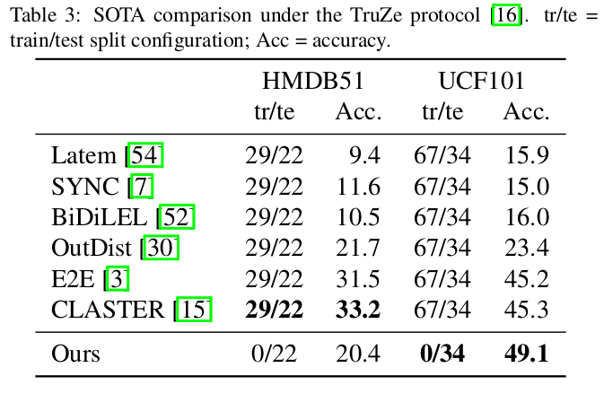
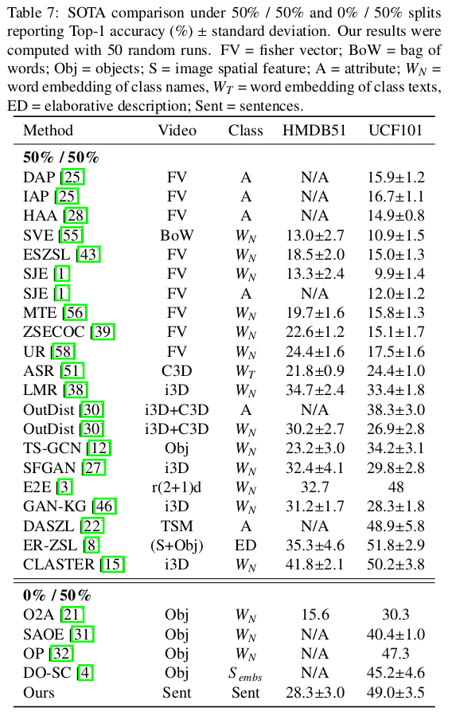
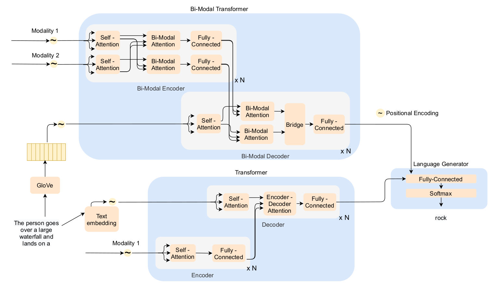
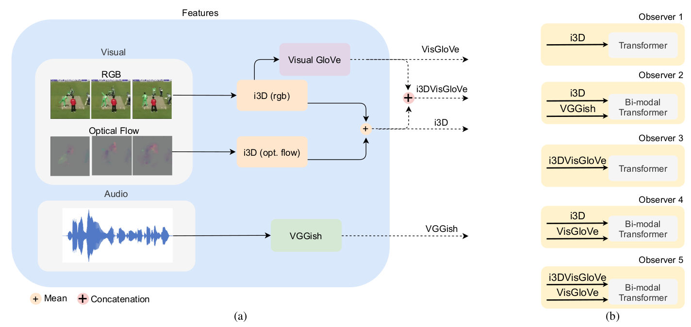

# **Tell me what you see: A zero-shot action recognition method based on natural language descriptions**

## **Summary**

This repository contains the implementation for the paper "Tell me what you see: A zero-shot action recognition method based on natural language descriptions" [ArXiv link](https://arxiv.org/abs/2112.09976).

As shown in Figure 1, several captioning models (called observers) watch the videos and provide a sentence description. These descriptions are projected onto a semantic space shared with textual descriptions for each action class.


![The semantic representation of our ZSAR method. In (a), we show the visual representation procedure. A video is seen by some video captioning systems, called Observers, which produce a video description. In (b), the semantic representation is shown. Using a search engine on the Intenet, we collect documents containing textual descriptions for the classes. In this case, the Balance Beam action is preprocessed to select the ten most similar sentences compared to the class name. Finally, in (c), the joint embedding space constructed using a BERT-based paraphrase embedder is used to project both representations in a highly structured semantic space.](./images/figure1.png)

**Figure 1.** The semantic representation of our ZSAR method. In (a), we show the visual representation procedure. A video is seen by some video captioning systems, called Observers, which produce a video description. In (b), the semantic representation is shown. Using a search engine on the Intenet, we collect documents containing textual descriptions for the classes. In this case, the Balance Beam action is preprocessed to select the ten most similar sentences compared to the class name. Finally, in (c), the joint embedding space constructed using a BERT-based paraphrase embedder is used to project both representations in a highly structured semantic space.

We reach state-of-the-art performance on UCF101 and competitive performance on HMDB51 in a scenario in which no training classes are used for training the ZSAR method. The tables below show our results under the TruZe protocol (GOWDA et al., 2021) and under a relaxed ZSAR constraint (for details and explanation on this relaxed constraint, see Section 4.5.6 from the paper).





The code was tested on Ubuntu 20.10 with NVIDIA GPU Titan Xp. Using another software/hardware might require adapting conda environment files.


## **Observers**

Our Observers came from two different architectures shown in Figure 2, the bi-modal transformer (BMT) (IASHIN and RAHTU, 2021), and transformer - using the MDVC implementation (IASHIN and RAHTU, 2021) with different feature schemes as inputs, shown in Figure 3.



**Figure 2.** Overview of the captioning architectures showing the Bi-Modal Transformer and Transformer layers with their inputs and the language generation module. Adapted from Estevam *et al.* (2021).



If you are interested in retraining or reproducing our observer results, see the repository [DVCUSI](https://github.com/valterlej/dvcusi) for instructions on how to get and run the captioning models. At the same time, if you desire to compute your Visual GloVe features, there are instructions for it too.

+ Informations

*All the features used are available for download in the Downloads section.*

We format the data from UCF101 and HMDB51 in a format processed by BMT or MDVC methods. The files data/ucf101/ucf101_bmt_format.txt, data/ucf101/ucf101_mdvc_format.txt, data/hmdb51/hmdb51_bmt_format.txt, and data/hmdb51/hmdb51_mdvc_format.txt must replace the Activitynet Captions validation files when using the observer models to produce descriptive sentences.


## Reproducing our results

### Step 1: clone this repository

```bash
git clone git@github.com:valterlej/zsarcap.git
```

### Step 2: create the conda environment

```bash
conda env create -f ./conda_env.yml
conda activate zsar
```

### Step 3: install the spacy module

```bash
python -m spacy download en
```

### Step 4: install sent2vec module

```bash
cd model/sent2vec
make
pip install .
```

For more details see [https://github.com/epfml/sent2vec#setup-and-requirements](https://github.com/epfml/sent2vec#setup-and-requirements).

### Step 5: Download wikibigrams.bin file

Download and save [wikibigrams.bin](https://1drv.ms/u/s!Atd3eVywQZMJgxxSzJTJH7KKPAba?e=KTDDkw) on data/ directory. (~ 17.2 GB).


### Step 6: Download observers predictions

Download and save [observers_predictions.zip](https://1drv.ms/u/s!Atd3eVywQZMJgwskSqSeyLAp-TWk?e=atR1dz) on data/


### Step 7: Run experiment

Some example commands:

- UCF101
```bash
python run_experiment.py --dataset_name ucf101 \
    --dataset_class_list ./data/ucf101/texts/ucf_classes.txt \
    --dataset_train_test_class_list ./data/ucf101/texts/truezsl_splits.json \
    --dataset_descriptions_dir ./data/ucf101_texts/ \
    --embedder_for_semantic_preprocessing paraphrase-distilroberta-base-v2 \
    --zsar_embedder_name paraphrase-distilroberta-base-v2 \
    --min_words_per_sentence_description 15 \
    --max_sentences_per_class 10 \
    --k_neighbors 1 \
    --metric cosine \
    --observer_paths data/observers/ob1_transformer_i3d/ucf101.json data/observers/ob2_bmt_i3d_vggish/ucf101.json data/observers/ob3_transformer_i3dvisglove/ucf101.json
```

Use all observers to reproduce the paper results.


- HMDB51
```bash
python run_experiment.py --dataset_name hmdb51 \
    --dataset_class_list ./data/hmdb51/texts/hmdb_classes.txt \
    --dataset_train_test_class_list ./data/hmdb51/texts/truezsl_splits.json \
    --dataset_descriptions_dir ./data/hmdb51_texts/ \
    --embedder_for_semantic_preprocessing paraphrase-distilroberta-base-v2 \
    --zsar_embedder_name paraphrase-distilroberta-base-v2 \
    --min_words_per_sentence_description 15 \
    --max_sentences_per_class 10 \
    --k_neighbors 1 \
    --metric cosine \
    --observer_paths data/observers/ob1_transformer_i3d/hmdb51.json data/observers/ob1_transformer_i3d/hmdb51_sk16_sp16.json data/observers/ob1_transformer_i3d/hmdb51_sk10_sp10.json
```

You can see all the parameters with:

```bash
python run_experiment.py --help
```


## **Downloads** 

- Features
  
  ActivityNet Captions [acnet_sk24_sp24.zip](https://1drv.ms/u/s!Atd3eVywQZMJgwosUduU8lNKc3fW?e=hTElJU), [vggish_acnet.zip](https://1drv.ms/u/s!Atd3eVywQZMJgx2cYZmIIIIO6lKJ?e=084mlI)
  
  UCF101 [ucf101_sk24_sp24.zip](https://1drv.ms/u/s!Atd3eVywQZMJgwin4kaU9DW9qCCZ?e=L6hI57), [vggish_ucf101.zip](https://1drv.ms/u/s!Atd3eVywQZMJgx6aJrjhQpY4HaON?e=jh52uP)

  HMDB51 [hmdb51_sk24_sp24.zip](https://1drv.ms/u/s!Atd3eVywQZMJgwfw4Mtu0oTAx6ng?e=5ldabW), [hmdb51_sk16_sp16.zip](https://1drv.ms/u/s!Atd3eVywQZMJgwWXdzT6T04caEZH?e=XVbexn), [hmdb51_sk10_sp10.zip](https://1drv.ms/u/s!Atd3eVywQZMJgwQDJNNRZS8GIXQt?e=dheuba).
  
- Observers (pre-trained models) [observers_models.zip](https://1drv.ms/u/s!Atd3eVywQZMJgxu2u38QkaZR1t-I?e=MKtXsH)
- Observers (predictions for ucf101 and hmdb51) [observers_predictions.zip](https://1drv.ms/u/s!Atd3eVywQZMJgwskSqSeyLAp-TWk?e=atR1dz)


## **Main References**

Visual GloVe
- Estevam, V.; Laroca, R.; Pedrini, H.; Menotti, D. **Dense Video Captioning using Unsupervised Semantic Information**. In. CoRR, 2021.

MDVC
- Iashin, V.; Rahtu, E. **Multi-Modal Dense Video Captioning**. In IEEE Conference on Computer Vision and Pattern Recognition (CVPR) Workshops, 2020, pp. 958-959.

BMT
- Iashin, V.; Rahtu, E. **A Better Use of Audio-Visual Cues: Dense Video Captioning with Bi-modal Transformer**. In. British Machine Vision Conference (BMVC), 2020.

TruZe protocol
- Gowda S.N.; Sevilla-Lara L.; Kim K.; Keller F.; Rohrbach M. **A New Split for Evaluating True Zero-Shot Action Recognition**. In: Bauckhage C., Gall J., Schwing A. (eds) Pattern Recognition. DAGM GCPR, 2021. Lecture Notes in Computer Science, vol 13024. Springer, Cham.

For the complete list, see the paper.

## **Citation**

Our paper is available on arXiv. Please, use this BibTeX if you would like to cite our work.

```latex
@article{estevam:2021
author = {Estevam, V. and Laroca, R. and Pedrini, H. and Menotti, D.},
title = {Tell me what you see: {A} zero-shot action recognition method based on natural language descriptions},
journal = {CoRR},
year = {2021},
url = {https://arxiv.org/abs/2112.09976}
}
```
